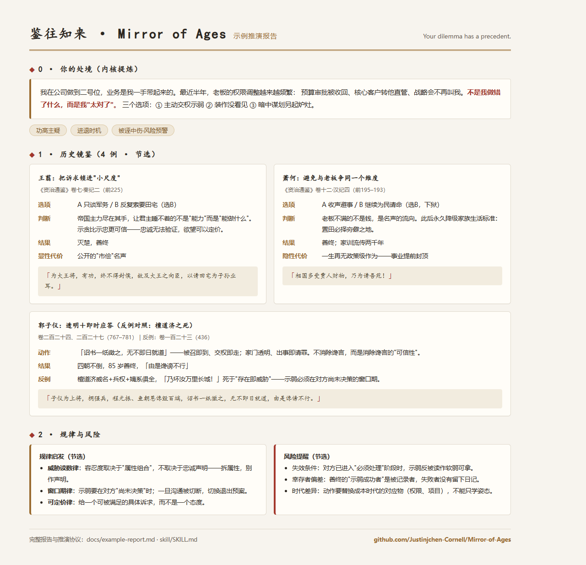

# Mirror of Ages · 鉴往知来

> **你的纠结，古人下过。** ｜ *Your dilemma has a precedent.*

用《资治通鉴》（294 卷）与《史记》（130 篇）做**人生抉择推演**的结构化技能——把三千年历史里的抉择案例，拆解成「选项 → 判断 → 结果 → 显性代价 → 隐性代价 → 规律 → 风险」，供个人与组织决策镜鉴。

适用于 Claude Code 等 AI Agent 技能生态，也可作为独立的历史决策案例库使用。

---

## 演示



> 上图为一份真实输出示例（职场「功高主疑」情境）。完整报告（含结构对照、规律启发、风险提醒与行动提示）→ [docs/example-report.md](docs/example-report.md)；首发推广文案（公众号 / 即刻 / X）→ [docs/launch-kit.md](docs/launch-kit.md)

## 名字由来

- **鉴往知来**：化用《资治通鉴》卷143明文「前事之不忘，后事之师也」，及宋神宗赐名典故"鉴于往事，有资于治道"。
- **Mirror of Ages**：《资治通鉴》英文通译即 *Comprehensive Mirror*——"鉴"本是镜；Ages 是三千年。一面照向过去、也照向下一代的镜子。
- Slogan：*What's past is prologue.*（莎士比亚《暴风雨》：过去皆为序幕。）

## 它解决什么问题

你面临的重大抉择——去留、进退、合伙、谈判、接班、被诬、改革、传承——**在两千年史书里几乎都有先例**。本技能不是"读史感悟"，而是把先例拆成可对照的结构：当事人当时**有哪些选项**（包括他放弃的那个）、他**怎么判断**的、**结果与代价**是什么（刻意区分显性/隐性代价）、以及——**哪些规律可迁移、哪些会在今天失效**。

## 核心能力

| 模块 | 内容 |
|------|------|
| **44 张案例卡** | 12 个主题：立身之本 / 变革风险 / 弱者博弈 / 承诺与欺诈 / 识人用人 / 功成身退 / 权力交接 / 高位自处 / 逆境生存 / 大决策偏误 / 谏与纳谏 / 延续与后路 |
| **28 个场景内核** | 功高主疑、进退时机、合伙人反目、轻信承诺……内核→检索词→案例 的映射表 |
| **73 条引文登记** | 每条引文附**卷次/篇名 + 行号**，逐条对照原文核验过 |
| **双库全文检索** | `tools/retrieve.py`：关键词 / 内核 / 卷次 / 案例 四种检索方式，294 卷 + 130 篇秒级命中 |
| **7 步推演协议** | 接题 → 提炼内核 → 两级检索 → 案例拆解 → 古今映射 → 规律启发 → 风险提醒（含失效条件）；内置质量红线 |

## 示例：一张案例卡（节选）

> **萧何：从自污到入狱，再到一座"劣质"的庄园**
> 出处：《资治通鉴》卷十二·汉纪四（前195–193）
>
> - **当时的选项**：（A）收声、什么都不说（B）为民请命（选了B，触发怒火）
> - **判断与推理**：萧何长期守关中、得民心——这在战时是资产，在和平期变成负债（"自媚于民"的嫌疑）……
> - **显性代价**：狱中受辱（械系）、晚年谨小慎微
> - **隐性代价**：萧何一生再未有政策级作为——把功勋转化为"没有威胁的遗产"，代价是事业提前封顶
> - **规律启发**：不要在对方最看重的维度上比他更强；把后代的生活"逆优化"（劣田薄产）
> - **风险提醒**：本案例不是"替领导背锅"的鸡汤，而是结构性风险的识别与对冲
> - **原文**：「上大怒曰：“相国多受贾人财物，乃为请吾苑！”下相国廷尉，械系之。」（卷十二）

完整推演报告模板（对照表 + 规律 + 风险 + 行动提示）见 [`skill/SKILL.md`](skill/SKILL.md)。

## 快速开始

### 方式一：作为 Claude Code 技能使用（推荐）

```bash
# 1. 安装技能
cp -r skill ~/.claude/skills/tongjian-choice

# 2. 准备语料（因版权与体积未随仓库分发，见 skill/data/README.md）
#    将《资治通鉴》全文放入 skill/data/zztj.txt
#    将《史记》全文放入  skill/data/shiji.txt

# 3. 让 Agent 直接开始推演
#    对它说："用通鉴推演一下我现在的抉择：……"
```

### 方式二：独立使用检索工具

```bash
python skill/tools/retrieve.py --list-kernels          # 查看 28 个场景内核
python skill/tools/retrieve.py --kernel 功高主疑        # 内核检索（含相关案例）
python skill/tools/retrieve.py 震主者身危 --src zztj    # 关键词限定通鉴检索
python skill/tools/retrieve.py --case xiaohe           # 查一张案例卡的元数据
```

## 仓库结构

```
Mirror-of-Ages/
├── skill/
│   ├── SKILL.md        # 7 步推演协议 + 报告模板 + 质量红线
│   ├── cases/          # 44 张案例卡（12 个主题文件）+ _index.json
│   ├── data/           # kernels.json / quotes.json / 卷篇索引（语料请自备）
│   ├── tools/          # retrieve.py 双库检索工具及索引（语料未含）
│   ├── patterns.md     # 12 条跨案例规律（带证据与失效条件）
│   ├── cheatsheet.md   # 决策规则速查 + 反模式清单
│   └── glossary.md     # 场景内核词典 + 典故术语（附卷次）
└── README.md
```

## 出处与质量规范

- 所有历史引用均可回溯到**卷次/篇名**；引文与原文逐条核验（见 `skill/data/quotes.json`）。
- 已知语料缺口：电子底本缺《资治通鉴》卷 189、214–218、223（含安史之乱爆发段），相关主题已回避或标注。
- 案例卡同时标注"判断对错"与"结果好坏"两套评价，明确提示**幸存者偏差**——被史书记录的多是胜者与教训，沉默的失败样本不存在。

## 路线图

- [ ] 补齐缺失卷次（189、214–218、223）后扩充唐纪案例
- [ ] 英文案例卡（面向 *Mirror of Ages* 英文读者）
- [ ] 内核库扩容（目标 50+），新增"婚姻家族""师友背弃""移民去国"等主题
- [ ] 决策复盘模板（用户用后回填结果，形成自己的案例账本）

## 授权与免责

- 代码（`tools/`）以 MIT 授权；内容（案例、文档、数据索引）以 CC BY-NC-SA 4.0 授权，详见 [LICENSE.md](LICENSE.md)。
- 案例卡中的原文引文均注明出处，仅用于评论与研究（合理引用）；未随仓库分发的语料全文版权归相应出版方。
- 本项目提供思考框架，**不构成投资、法律或医疗建议**；历史规律有时代边界，请勿直接套用。

---

## English

**Mirror of Ages** is a structured *decision-simulation skill* built on two Chinese historical classics: *Zizhi Tongjian* (Comprehensive Mirror, 294 volumes) and *Shiji* (Records of the Grand Historian, 130 chapters).

It retrieves historical cases sharing the **same decision structure** as your situation, and dissects each case into: *options available → judgment → outcome → explicit & hidden costs → transferable patterns → risk caveats* — each quote verified with volume/line citations.

- 44 case cards across 12 themes (career moves, partnerships, negotiation, succession, crisis, reputation…)
- 28 "situation kernels" for structural retrieval
- A 7-step simulation protocol with a built-in quality gate
- *“Your dilemma has a precedent.”*

See [`skill/SKILL.md`](skill/SKILL.md) for the full workflow. Full texts are not bundled (copyright/size) — see `skill/data/README.md`.
